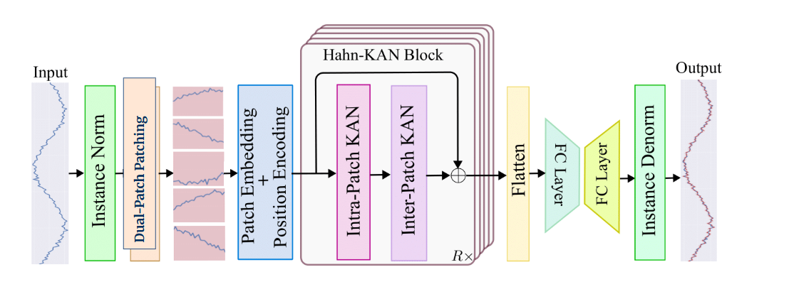

# MS-HaKAN: Multi-Scale Hahn Kolmogorov-Arnold Networks for Time-Series Forecasting

An optimized, dual-stream extension of the HaKAN architecture specifically enhanced to handle high-noise financial time-series data like the Hang Seng Index (HSI) along with standard physical benchmarks. By incorporating Multi-Scale Patching, Series Decomposition, and Capacity Regularization, this implementation successfully scales the performance of edge-based polynomial networks.

---

## 📄 Acknowledgements & Citations

This repository builds directly upon the foundational work of the Hahn-KAN framework. 

* **Original Paper:** *HaKAN: Time Series Forecasting with Hahn Kolmogorov-Arnold Networks* (Hasan et al., 2026).
* **Original Codebase:** `https://github.com/zadidhasan/HaKAN`

---

## **Time Series Forecasting with Hahn Kolmogorov-Arnold Networks**

This repository contains the code for our project on long-term time series forecasting.

<h3>Architecture</h3>
The model integrates channel independence, reversible instance normalization, and patching, followed by patch and position embeddings. A stack of R Hahn-KAN blocks, each with intra-patch and inter-patch KAN layers using Hahn polynomials, processes the embedded sequence to capture temporal patterns. The output is mapped through a bottleneck structure with two fully connected layers to produce the final forecast.

<p align="center">
  
</p>

### 📊 Long-term Forecasting Results (Avg. MSE, MAE)

**Look-back = 96**, averaged over **T ∈ {96, 192, 336, 720}** Lower is better.

| Dataset | **HaKAN** | S-Mamba | iTrans | RLinear | PatchTST | Crossf. | TiDE | TimesNet | FEDformer |
|--------|-----------|---------|--------|---------|----------|---------|------|-----------|-----------|
| ETTh1 | **0.439 (0.429)** | 0.455 (0.450) | 0.454 (0.447) | 0.446 (0.434) | 0.469 (0.454) | 0.529 (0.522) | 0.541 (0.507) | 0.458 (0.450) | 0.440 (0.460) |
| ETTh2 | **0.348 (0.383)** | 0.381 (0.405) | 0.383 (0.407) | 0.374 (0.398) | 0.387 (0.407) | 0.942 (0.684) | 0.611 (0.550) | 0.414 (0.427) | 0.437 (0.449) |
| ETTm1 | **0.384 (0.399)** | 0.398 (0.405) | 0.407 (0.410) | 0.414 (0.407) | 0.387 (0.400) | 0.513 (0.496) | 0.419 (0.419) | 0.400 (0.406) | 0.448 (0.452) |
| ETTm2 | **0.276 (0.324)** | 0.288 (0.332) | 0.288 (0.332) | 0.286 (0.327) | 0.281 (0.326) | 0.757 (0.610) | 0.358 (0.404) | 0.291 (0.333) | 0.305 (0.349) |

📌 Format: **MSE (MAE)**.

---

## 🛠️ Our Proposed Extension: Multi-Scale HaKAN (MS-HaKAN)

While uniform temporal patching works efficiently on physical benchmarks, volatile market indices carry competing high-frequency noise and low-frequency macro trends. 

Our updated architecture introduces a **Dual-Stream Multi-Scale Patching Pipeline** to resolve this operational tradeoff:
* **Macro Perspective Stream:** Extracts long-term cyclic features using a larger window structure (Patch 16, Stride 8).
* **Micro Perspective Stream:** Captures short-term transactional shifts using finer graining (Patch 8, Stride 4).

To prevent overparameterization and noise injection across the dual-streams, we integrated an inline **Series Decomposition** block to isolate Trend and Residual fields, alongside an optimized **Capacity Bottleneck** restricting model dimensions to `d_model = 128` and `d_ff = 512`.

<p align="center">
  
</p>

### 📈 Final Optimized Performance Summary

By adapting the core architecture into a regularized multi-scale design, the model achieves noticeable improvements over the single-scale benchmark baselines:

* **Hang Seng Index (Custom Financial Asset):** Single-Scale Baseline MSE `0.7467` $\rightarrow$ **MS-HaKAN Optimized MSE 0.7366** (MAE optimized to **0.5222**).
* **ETTm1 (Standard Benchmark Dataset):** Single-Scale Baseline MSE `0.3840` $\rightarrow$ **MS-HaKAN Optimized MSE 0.3802**.

---

## 🚀 Getting Started

### 1. Installation
Clone the repository and install dependencies:
```bash
git clone [https://github.com/jemi2k/HahanKAN.git](https://github.com/jemi2k/HahanKAN.git)
cd HahanKAN
