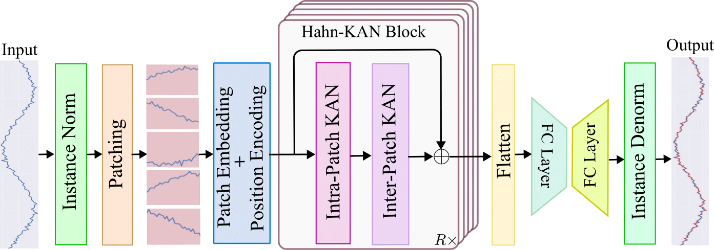

# HaKAN
**Time Series Forecasting with Hahn Kolmogorov-Arnold Networks**

This repository contains the code for our project on long-term time series forecasting.

<h3>Architecture</h3>
<p align="center">
  
</p>

### Results

<details>
<summary><strong>📊 Long-term Forecasting Results (Avg. MSE / MAE)</strong></summary>

<br/>

**Look-back = 96**, Prediction lengths **T ∈ {96, 192, 336, 720}**  
Lower is better.

| Dataset | HaKAN (ours) | S-Mamba | iTransformer | RLinear | PatchTST/64 | Crossformer | TiDE | TimesNet | FEDformer |
|-------|--------------|---------|--------------|---------|-------------|-------------|------|----------|-----------|
| ETTh1 | **0.439 / 0.429** | 0.455 / 0.450 | 0.454 / 0.447 | 0.446 / 0.434 | 0.469 / 0.454 | 0.529 / 0.522 | 0.541 / 0.507 | 0.458 / 0.450 | 0.440 / 0.460 |
| ETTh2 | **0.348 / 0.383** | 0.381 / 0.405 | 0.383 / 0.407 | 0.374 / 0.398 | 0.387 / 0.407 | 0.942 / 0.684 | 0.611 / 0.550 | 0.414 / 0.427 | 0.437 / 0.449 |
| ETTm1 | **0.384 / 0.399** | 0.398 / 0.405 | 0.407 / 0.410 | 0.414 / 0.407 | 0.387 / 0.400 | 0.513 / 0.496 | 0.419 / 0.419 | 0.400 / 0.406 | 0.448 / 0.452 |
| ETTm2 | **0.276 / 0.324** | 0.288 / 0.332 | 0.288 / 0.332 | 0.286 / 0.327 | 0.281 / 0.326 | 0.757 / 0.610 | 0.358 / 0.404 | 0.291 / 0.333 | 0.305 / 0.349 |

📌 **Full results (all horizons)** are reported in the paper.
</details>


### Requirements
<pre><code>pip install numpy==1.24.3 matplotlib==3.7.2 pandas==2.0.3 scikit-learn==1.3.0 torch==2.4.1+cu121 </code></pre>

### Datasets
------
The datasets are hosted on Google Drive by Autoformer. Please download them and place them in the `./datasets/` directory before running the experiments.

👉 [Access the Datasets on Google Drive](https://drive.google.com/drive/folders/1ZOYpTUa82_jCcxIdTmyr0LXQfvaM9vIy)

### Experiments
If you want to run an experiment, just run the following script and edit it as you need. This script is for the look-back window is 96.
<pre><code>sh ./scripts/SHORT/etth1.sh</code></pre>
If you want to run an experiment for the look-back window 336, you should run the following script:
<pre><code>sh ./scripts/LONG/etth1.sh</code></pre>


### 📄 Citation

If you use this work, please cite:

```bibtex
@inproceedings{Hasanetal-2026-HaKAN,
  title     = {HaKAN: Time Series Forecasting with Hahn Kolmogorov-Arnold Networks},
  author    = {Hasan, Md Zahidul and
               Ben Hamza, Abdessamad and
               Bouguila, Nizar},
  booktitle = {Proceedings of the International Conference on Artificial Intelligence and Statistics},
  year      = {2026}
}
